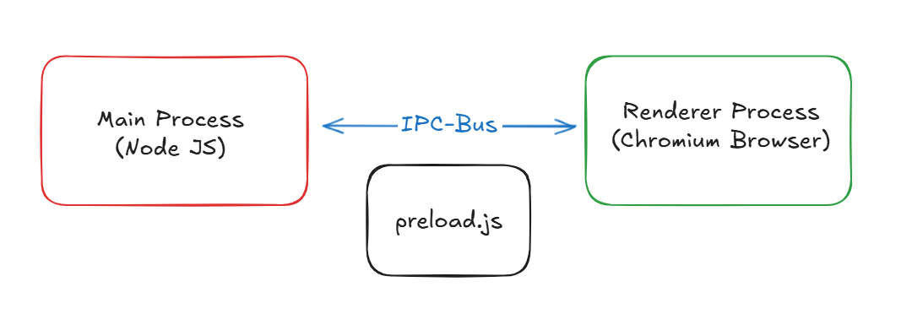
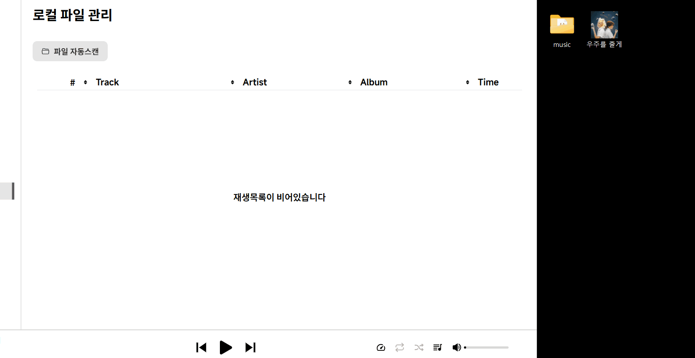
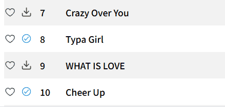

<p align='center'>
  
</p>

<p align="center">
    <a href="https://releases.electronjs.org">
        
    </a>
    <a href="https://github.com/Heonys/topzl-desktop/releases">
        
    </a>
    <a href="https://github.com/Heonys/topzl-desktop/actions/workflows/release.yml">
        
    </a>
</p>

<div align="center">

![Main Page][main-screenshot]
</div>

## 🚀 Introduction

**Topzl**은 광고 없는 무료 음악 스트리밍을 위한 데스크탑 어플리케이션 입니다. 최신 `Electron` 버전과 `electron-vite`를 기반으로 UI는 `React` 환경과 통합하여 개발 되었습니다. 크로스 플랫폼 지원을 통한 호환성과 아름다운 인터페이스 및 다양한 기능을 제공하는 것을 목표로 합니다.

소프트웨어 다운로드는 저장소의 [Releases](https://github.com/Heonys/topzl-desktop/releases) 페이지에서 확인할 수 있습니다. 현재는 `Windows` 환경에서만 안정적으로 동작하기에 `Windows` 전용으로 제공됩니다.

> **notice**: 현재 릴리즈 버전은 `Windows` 만을 제공하지만 [클라이언트 패키징](#클라이언트-패키징)을 통해서 다른 플랫폼에서 직접 패키징이 가능합니다. 다만 이 경우 메뉴, 트레이 등 일부 기능에서 차이가 있을 수 있습니다.


## ⚠️**Important**
이 프로젝트는 [猫头猫/MusicFreePlugins](https://gitee.com/maotoumao/MusicFreePlugins) 저장소의 `audiomack` 플러그인을 사용하여 음원의 재생 URL을 가져옵니다. 내부적으로는 [audiomack api](https://audiomack.com/data-api/docs)를 사용하지만 유료 컨텐츠는 필터링되어 있습니다. 이 플러그인은 학습 및 참고 용도로만 제공되며, 상업적 용도로 사용하지 않아야 하고, 반드시 합법적으로 사용해야 한다고 정의되어 있습니다.

`Topzl`역시 동일한 목적으로 개발된 프로젝트 입니다. 프로젝트 사용 과정에서 저작권이 있는 데이터가 생성될 수 있으므로 이에 대한 주의가 필요합니다. 또한, 현재 개인용 및 학습용으로만 사용을 권장하며, 코드 사이닝 없이 배포되고 있기에 설치시 운영 체제에서 경고 메시지가 표시될 수 있습니다.


## ✨ Features
- 크로스 플랫폼 지원 (Windows, macOS, Linux)
- 음악, 앨범, 아티스트, 플레이리스트 검색
- HLS 기반의 자체 스트리밍
- 로컬 음악 재생 지원
- 음원 다운로드 지원
- 워커 스레드를 활용한 로컬 폴더 모니터링 및 동기화
- 가사 지원 (웹 크롤링 기반, 정확도 불안정)
- 로그인 없이 사용 가능 (스토리지 및 AppData에 사용자 데이터 저장)
- 다국어 지원 (한국어, 영어)
- 사용자 지정 단축키 지원 (In-App, Global)
- 세부 설정 지원 (일반, 재생, 다운로드, 가사, 백업 및 복원)
- PIP 모드 지원


## 🎉 Getting Started

- #### 개발 환경 셋업
```sh
# 저장소 클론
git clone https://github.com/Heonys/topzl-desktop.git

# 의존성 설치
yarn install

# 개발 서버 실행
yarn dev
```
- #### 클라이언트 패키징
현재 릴리즈된 버전은 안정적인 `Windows`만 제공되지만 `macOS`와 `Linux`를 클라이언트에서 직접 패키징 할 수 있도록 설정되어 있습니다. 이를 통해 다른 운영체제 에서도 직접 패키징하여 실행이 가능합니다. `electron-builder.json` 파일 에서 빌드 옵션을 수정할 수 있습니다.

> **Note**: 자세한 빌드 설정은 [electron-builder](https://www.electron.build/) 문서 에서 확인 가능합니다.

```json
// electron-builder.json
"win": {
  "target": ["nsis", "zip"],
},
"mac": {
  "target": ["dmg"],
},
"linux": {
  "target": ["AppImage"],
},
```

```sh
yarn dist:{flatform} # [win, mac, linux]
```

## 🖼️ Screenshot

<details>
<summary>
  <strong>스크린샷을 확인 하려면 펼쳐주세요</strong>
</summary>

![Main][main-screenshot]
![Search][search-screenshot]
![Search Album][seach_album-screenshot]
![Detail][detail-screenshot]
![Libray][library-screenshot]
![Palylist][playlist-screenshot]
![Local][local-screenshot]
![Download][download-screenshot]
![Pipmode][pipmode-screenshot]
![Setting1][settings1-screenshot]

</details>

## 🧩 Technical Detail

<!-- <details>
  <summary style="font-size: 1.3em;">
    <strong>🔖 목록 </strong>
  </summary>
</details> -->

### 1. Electorn의 기본 구조 및 동작원리

<p align="center">
  
</p>


`Electron`은 크로스 플랫폼 데스크탑 어플리케이션을 만들 수 있게 해주는 프레임워크 입니다. `Chromium` 엔진과 `Node JS`를 통합하여 웹기술을 그대로 사용할 수 있으며, 다양한 프레임 워크와 통합하여 사용할 수 있는 것이 특징입니다. 일렉트론은 기본적으로 메인 프로세스와 렌더러 프로세스로 나뉘게 나뉘게 됩니다.

`Main Process`는 윈도우를 생성할 수 있으며 일렉트론 앱 전체의 생명주기를 관리하고 상호작용 합니다. `System API`에 접근할 수 있어 데스크탑 알림, 시스템 트레이 등의 기능 또한 상호작용이 가능하며, `Node.js` 런타임에서 동작하기에 `npm` 패키지 사용 또는 `fs`, `os` 등의 내장 모듈 또한 역시 사용할 수 있습니다.

`Renderer Process`는 실제 사용자 인터페이스를 렌더링하는 프로세스로 메인 프로세스에서 만들어진 윈도우가 렌더러 프로세스의 실행환경이 되어 `UI`를 렌더링할 수 있는 `Chromium` 기반의 브라우저 창을 제공하게 됩니다.

렌더러 프로세스는 결국 `Node` 환경 위에서 실행되기 때문에 직접 노드 모듈에 접근하는 것이 가능합니다. 하지만 일반적인 일렉트론 개발에선 보안을 위해 브라우저 환경과 노드 환경을 완전히 격리 시켜서 실행하기 때문에 프로세스간의 `IPC` 통신을 통해서 데이터를 주고받으며, 안전한 `IPC`통신을 위해서 `preload.js` 파일을 사용합니다.

```js
// #preload.js
const { contextBridge, ipcRenderer } = require("electron");

contextBridge.exposeInMainWorld("electron", {
  sendMessage: (msg) => ipcRenderer.send("message", msg),
});
```
```js
// #renderer process
window.electron.sendMessage("Hello from Renderer!");
// contextBridge에서 api를 노출시켰기 때문에 window 객체에 속성이 추가됨
```

`preload.js`는 렌더러 프로세스가 초기화 되기전에 실행되는 스크립트로 메인 프로세스와 유사한 권한을 가지는 특수한 파일입니다. `contextBridge`를 통해서 안전하게 렌더러 프로세스에 노출하려는 `API`를 정의할 수 있고, 이를 통해 메인 프로세스와 렌더러 프로세스간의 안전한 통신을 가능하게 하는 중간다리 역할을 합니다.

>즉, 일렉트론은 렌더러 프로세스를 통해 사용자와 상호작용하는 UI를 제공하며, 메인 프로세스와의 IPC 통신을 통해 데이터를 요청하고 화면을 업데이트하는 방식으로 동작합니다.

### 2. 다중 윈도우간 통신

메인 프로세스는 여러 개의 윈도우를 생성할 수 있으며 각 렌더러 프로세스는 메인 프로세스와의 통신을 합니다. 하지만 `IPC`통신으로는 메인과 렌더러간의 소통만 가능하기에 렌더러 프로세스간 상태를 공유하기 위해서는 메인 프로세스에서 상태를 중개해야만 합니다.

<p align="center">
  
</p>

현재 `Topzl` 어플리케이션에선 메인 윈도우 외에 작은 플레이어 형태의 `PIP`모드를 지원합니다. `PIP`모드는 메인 윈도우의 재생상태 또는 현재 재생중인 곡의 정보를 공유 하며, 재생, 이전곡, 다음곡의 버튼을 제공합니다. 즉, `PIP`모드를 제공하는 윈도우는 메인 윈도우와 동시에 실행되며 상태를 일정부분 공유하고 반대로 메인 윈도우의 상태를 수정할 수 있어야합니다. 이를 위해서 `IPC`통신 대신 `MessageChannelMain`를 사용하여 포트간의 통신을 통해서 메시지 전달과 상태를 공유할 수 있도록 구현 했습니다.


```ts
// pipmode wiondow가 생성되는 시점에 포트를 연결하여 mainwindow의 상태를 전달
const { port1, port2 } = new MessageChannelMain();

mainWindow.webContents.postMessage("port", null, [port1]);
pipWindow.webContents.postMessage("port", { track: currentItem, state }, [port2]);
```

이렇게하면 각 윈도우들은 자신이 열결된 포트로 부터 반대편 포트에게 메시지를 보낼 수 있게 됩니다. `mainWindow`는 `port1`과 연결되어 트랙이 바뀌거나, 현재 플레이어의 상태가 바뀌면 `port2`에게 메시지를 전달합니다. 반면 `pipmodeWinodw`는 `port2`와 연결되어 `port1`으로부터 받은 상태로 부터 현재 윈도우에 동기화합니다 또한  `pipmodeWindow`에서도 트랙 정보를 바꿀 수 있지만, 직접 `mainWindow`의 상태를 바꿀 수 없기때문에 `mainWindow`에선 미리 메시지 핸들러를 설정하고 `port1`에게 특정 이벤트를 실행하도록 메시지 전달하도록 하여 `mainWindow`의 상태를 바꾸게 됩니다.


### 3. 워커 스레드

`Topzl` 에서는 로컬 파일 모니터링을 위한 `FileWatcher` 워커와 다운로드를 진행하고 그 다운로드의 상태를 실시간으로 렌더러에게 전달해주는 `Download` 워커 이렇게 2가지 워커 스레드를 사용합니다. `Comlink` 라이브러리를 사용하여 메인 스레드와 워커 스레드간의 상호작용을 메소드를 호출하는 방식으로 더 간결하게 작성하였습니다.

- #### 1) 로컬 폴더 모니터링

<p align="center">
 
</p>

로컬 페이지에선 폴더를 등록하고 그 폴더에서 오디오 파일의 메타데이터를 전부 뽑아서 리스트로 보여줍니다. 이 과정에서 `fs`모듈의 `watch` 메소드와 유사한 기능을 제공하는 `chokidar` 라이브러리를 사용하여 파일 시스템감지를 제공합니다. 이를 통해 등록한 폴더의 변화가 일어나면 그 변화를 렌더러 프로세스에 전달해서 화면을 업데이트하고 폴더 자체의 경로가 바뀌면 모니터링을 다시 시작 합니다.


- #### 2) 다운로드 및 다운로드 상태 동기화

<p align="center">
 
</p>

음원 다운로드 또한 워커 스레드에서 실행됩니다. 다운로드가 시작되면 렌더러 프로세스로 부터 전달받은 `URL`을 패칭합니다. `fetch API`는 노드에서도 지원하지만 여기서 주의해야할점은 `fetch`로 패칭된 결과는 `ReadableStream` 객체인데 이는 웹환경 에서 사용되는 스트림이기 때문에 이를 `Node`에서 사용 가능한 스트림으로 변환해야 합니다. 이 후 `writeStream`을 만들어서 파이프라인을 연결시켜 주고, 에러가 발생하거나 파이핑이 완료되면 렌더러러 에게 알려 화면을 업데이트 할 수 있도록 합니다.

```ts
async downloadFile(id: string, mediaSource: string, filePath: string) {
  const response = await fetch(mediaSource);
  const webStream = response.body as ReadableStream;
  const readableStream = Readable.fromWeb(webStream);
  const writeStream = fs.createWriteStream(filePath);

  pipeline(readableStream, writeStream, (err) => {
    if (err) {
      this.state = DownloadState.ERROR;
      this._onChange({ id, state: this.state, message: err.message });
      this.removeFile(filePath);
    } else {
      this.state = DownloadState.DONE;
      this._onChange({ id, state: this.state, current: total, total });
    }
  });
}
```

### 4. 플러그인 (audiomack api)


### 5. 가사 크롤링 (genius-api)


---

- 가상 스크롤 (useVirtualScroll)
- 드래그앤 드랍 (Droppable)
- Intersection Obserber (설정 페이지 섹션위치 조정)
- focus, blur 이벤트 핸들링 + tabIndex (퀵서치)  // 이름 정리
- 컨텍스트 메뉴 (좌표계산)
- eventEmitter (이벤트 추적)
- HLS (실시간 스트리밍)

- 다국어 처리
- 단축키 등록 (In-App, Global)
- 로컬 데이터베이스 (스토리지, IndexDB)


<!-- Markdown links and Images -->

[main-screenshot]: ./.imgs/main.png
[detail-screenshot]: ./.imgs/detail.png
[download-screenshot]: ./.imgs/download.png
[library-screenshot]: ./.imgs/library.png
[local-screenshot]: ./.imgs/local.png
[pipmode-screenshot]: ./.imgs/pipmode.png
[playlist-screenshot]: ./.imgs/playlist.png
[search-screenshot]: ./.imgs/search.png
[seach_album-screenshot]: ./.imgs/seach_album.png
[settings1-screenshot]: ./.imgs/settings1.png


