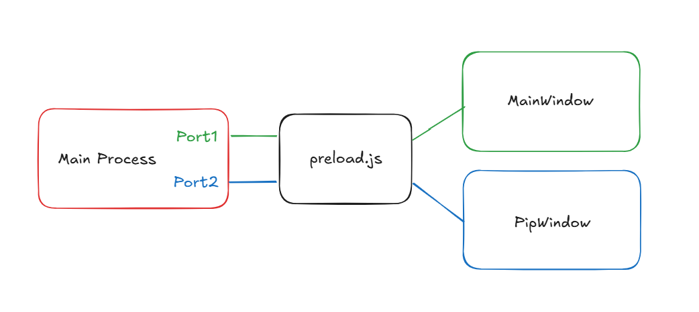
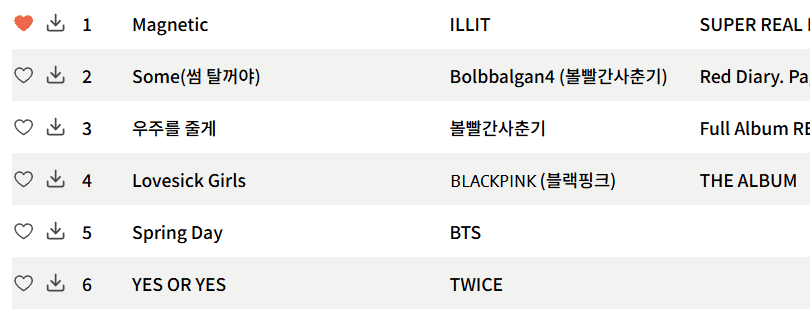

<p align='center'>
  
</p>

<p align="center">
    <a href="https://releases.electronjs.org">
        
    </a>
    <a href="https://github.com/Heonys/topzl-desktop/releases">
        
    </a>
    <a href="https://github.com/Heonys/topzl-desktop/actions/workflows/release.yml">
        
    </a>
</p>

<div align="center">

![Main Page][main-screenshot]
</div>

## 🚀 Introduction

**Topzl**은 광고 없는 무료 음악 스트리밍을 위한 데스크탑 어플리케이션 입니다. 최신 `Electron` 버전과 `electron-vite`를 기반으로 UI는 `React` 환경과 통합하여 개발 되었습니다. 크로스 플랫폼 지원을 통한 호환성과 아름다운 인터페이스 및 다양한 기능을 제공하는 것을 목표로 합니다.

소프트웨어 다운로드는 저장소의 [Releases](https://github.com/Heonys/topzl-desktop/releases) 페이지에서 확인할 수 있습니다. 현재는 `Windows` 환경에서만 안정적으로 동작하기에 `Windows` 전용으로 제공됩니다.

> **notice**: 현재 릴리즈 버전은 `Windows` 만을 제공하지만 [클라이언트 패키징](#클라이언트-패키징)을 통해서 다른 플랫폼에서 직접 패키징이 가능합니다. 다만 이 경우 메뉴, 트레이 등 일부 기능에서 차이가 있을 수 있습니다.


## ⚠️**Important**
이 프로젝트는 [猫头猫/MusicFreePlugins](https://gitee.com/maotoumao/MusicFreePlugins) 저장소의 `audiomack` 플러그인을 사용하여 음원의 재생 URL을 가져옵니다. 내부적으로는 [audiomack api](https://audiomack.com/data-api/docs)를 사용하지만 유료 컨텐츠는 필터링되어 있습니다. 이 플러그인은 학습 및 참고 용도로만 제공되며, 상업적 용도로 사용하지 않아야 하고, 반드시 합법적으로 사용해야 한다고 정의되어 있습니다.

`Topzl`역시 동일한 목적으로 개발된 프로젝트 입니다. 프로젝트 사용 과정에서 저작권이 있는 데이터가 생성될 수 있으므로 이에 대한 주의가 필요합니다. 또한, 현재 개인용 및 학습용으로만 사용을 권장하며, 코드 사이닝 없이 배포되고 있기에 설치 시 운영 체제에서 경고 메시지가 표시될 수 있습니다.


## ✨ Features
- 크로스 플랫폼 지원 (Windows, macOS, Linux)
- 음악, 앨범, 아티스트, 플레이리스트 검색
- 자체 스트리밍
- 로컬 음악 재생 지원
- 음원 다운로드 지원
- 워커 스레드를 활용한 로컬 폴더 모니터링 및 동기화
- 가사 지원 (웹 크롤링 기반, 정확도 불안정)
- 로그인 없이 사용 가능 (스토리지 및 AppData에 사용자 데이터 저장)
- 다국어 지원 (한국어, 영어)
- 사용자 지정 단축키 지원 (In-App, Global)
- 세부 설정 지원 (일반, 재생, 다운로드, 가사, 백업 및 복원)
- PIP 모드 지원

## 🖼️ Screenshot

<details>
<summary>
  <strong>스크린샷을 확인 하려면 펼쳐주세요</strong>
</summary>

![Main][main-screenshot]
![Search][search-screenshot]
![Search Album][seach_album-screenshot]
![Detail][detail-screenshot]
![Libray][library-screenshot]
![Palylist][playlist-screenshot]
![Local][local-screenshot]
![Download][download-screenshot]
![Pipmode][pipmode-screenshot]
![Setting1][settings1-screenshot]

</details>


## 🎉 Getting Started

- #### 개발 환경 셋업
```sh
# 저장소 클론
git clone https://github.com/Heonys/topzl-desktop.git

# 의존성 설치
yarn install

# 개발 서버 실행
yarn dev
```
- #### 클라이언트 패키징
현재 릴리즈된 버전은 안정적인 `Windows`만 제공되지만 `macOS`와 `Linux`를 클라이언트에서 직접 패키징 할 수 있도록 설정되어 있습니다. 이를 통해 다른 운영체제 에서도 직접 패키징하여 실행이 가능하고 `electron-builder.json` 파일 에서 빌드 옵션을 수정할 수 있습니다. 단, 릴리즈 버전과 동일하게 동작하면 환경변수로 `GENIUS_ACCESS_TOKEN`을 등록 해야 합니다.

> **Note**: 자세한 빌드 설정은 [electron-builder](https://www.electron.build/) 문서 에서 확인 가능합니다.

```json
// electron-builder.json
"win": {
  "target": ["nsis", "zip"],
},
"mac": {
  "target": ["dmg"],
},
"linux": {
  "target": ["AppImage"],
},
```
```sh
# .env
MAIN_VITE_GENIUS_ACCESS_TOKEN="..."
```
```sh
yarn dist:{flatform} # [win, mac, linux]
```

## 🧩 Technical Detail

<details>
  <summary style="font-size: 1.3em;">
    <strong>🔖 목록 </strong>
  </summary>

+ **[Electorn의 기본 구조 및 동작원리](#1-electorn의-기본-구조-및-동작원리)**
+ **[다중 윈도우간 통신](#2-다중-윈도우간-통신)**
+ **[워커 스레드](#3-워커-스레드)**
+ **[플러그인 (Audiomack)](#4-플러그인-audiomack)**
+ **[가사 검색](#5-가사-검색)**
+ **[가상 스크롤 (useVirtualScroll)](#6-가상-스크롤-usevirtualscroll)**
+ **[재생목록 정렬 (Drag & Drop)](#7-재생목록-정렬-drag--drop)**
+ **[Scroll Navigator](#8-scroll-navigator)**
+ **[Focus와 Blur 이벤트 흐름 제어](#9-focus와-blur-이벤트-흐름-제어)**
+ **[컨텍스트 메뉴](#10-컨텍스트-메뉴)**
+ **[EventEmitter](#11-eventemitter)**
+ **[단축키 등록 (In-App, Global)](#12-단축키-등록-in-app-global)**
+ **[로컬 데이터 관리](#13-로컬-데이터-관리)**
+ **[화면 캡처](#14-화면-캡처)**

</details>

### 1. Electorn의 기본 구조 및 동작원리

<p align="center">
  
</p>


`Electron`은 크로스 플랫폼 데스크탑 어플리케이션을 만들 수 있게 해주는 프레임워크 입니다. `Chromium` 엔진과 `Node JS`를 통합하여 웹기술을 그대로 사용할 수 있으며, 다양한 프레임 워크와 통합하여 사용할 수 있는 것이 특징입니다. 일렉트론은 기본적으로 메인 프로세스와 렌더러 프로세스로 나뉘게 나뉘게 됩니다.

`Main Process`는 윈도우를 생성할 수 있으며 일렉트론 앱 전체의 생명주기를 관리하고 상호작용 합니다. `System API`에 접근할 수 있어 데스크탑 알림, 시스템 트레이 등의 기능 또한 상호작용이 가능하며, `Node.js` 런타임에서 동작하기에 `npm` 패키지 사용 또는 `fs`, `os` 등의 내장 모듈 또한 역시 사용할 수 있습니다.

`Renderer Process`는 실제 사용자 인터페이스를 렌더링하는 프로세스로 메인 프로세스에서 만들어진 윈도우가 렌더러 프로세스의 실행환경이 되어 `UI`를 렌더링할 수 있는 `Chromium` 기반의 브라우저 창을 제공하게 됩니다.

렌더러 프로세스는 결국 `Node` 환경 위에서 실행되기 때문에 직접 노드 모듈에 접근하는 것이 가능합니다. 하지만 일반적인 일렉트론 개발에선 보안을 위해 브라우저 환경과 노드 환경을 완전히 격리 시켜서 실행하기 때문에 프로세스간의 `IPC` 통신을 통해서 데이터를 주고받으며, 안전한 `IPC`통신을 위해서 `preload.js` 파일을 사용합니다.

```js
// preload.js
const { contextBridge, ipcRenderer } = require("electron");

contextBridge.exposeInMainWorld("electron", {
  sendMessage: (msg) => ipcRenderer.send("message", msg),
});
```
```js
// renderer process
window.electron.sendMessage("Hello from Renderer!");
// contextBridge에서 api를 노출시켰기 때문에 window 객체에 속성이 추가됨
```

`preload.js`는 렌더러 프로세스가 초기화 되기전에 실행되는 스크립트로 메인 프로세스와 유사한 권한을 가지는 특수한 파일입니다. `contextBridge`를 통해서 안전하게 렌더러 프로세스에 노출하려는 `API`를 정의할 수 있고, 이를 통해 메인 프로세스와 렌더러 프로세스간의 안전한 통신을 가능하게 하는 중간다리 역할을 합니다.

>즉, 일렉트론은 렌더러 프로세스를 통해 사용자와 상호작용 하는 UI를 제공하며, 메인 프로세스와의 IPC 통신을 통해 데이터를 요청하고 화면을 업데이트하는 방식으로 동작합니다.

### 2. 다중 윈도우간 통신

메인 프로세스는 여러 개의 윈도우를 생성할 수 있으며 각 렌더러 프로세스는 메인 프로세스와의 통신을 합니다. 하지만 `IPC`통신으로는 메인과 렌더러간의 소통만 가능하기에 렌더러 프로세스간 상태를 공유하기 위해서는 메인 프로세스에서 상태를 중개해야만 합니다.

<p align="center">
  
</p>

현재 `Topzl` 어플리케이션에선 메인 윈도우 외에 작은 플레이어 형태의 `PIP`모드를 지원합니다. `PIP`모드는 메인 윈도우의 재생상태 또는 현재 재생 중인 곡의 정보를 공유 하며, 재생, 이전 곡, 다음 곡의 버튼을 제공합니다. 즉, `PIP`모드를 제공하는 윈도우는 메인 윈도우와 동시에 실행되며 상태를 일정 부분 공유하고 반대로 메인 윈도우의 상태를 수정할 수 있어야 합니다. 이를 위해서 `IPC`통신 대신 `MessageChannelMain`를 사용하여 포트간의 통신을 통해서 메시지 전달과 상태를 공유할 수 있도록 구현 했습니다.


```ts
// pipmode wiondow가 생성되는 시점에 포트를 연결하여 mainwindow의 상태를 전달
const { port1, port2 } = new MessageChannelMain();

mainWindow.webContents.postMessage("port", null, [port1]);
pipWindow.webContents.postMessage("port", { track: currentItem, state }, [port2]);
```

이렇게 하면 각 윈도우들은 자신이 연결된 포트로 부터 반대편 포트에게 메시지를 보낼 수 있게 됩니다. `mainWindow`는 `port1`과 연결되어 트랙이 바뀌거나, 현재 플레이어의 상태가 바뀌면 `port2`에 메시지를 전달합니다. 반면 `pipmodeWinodw`는 `port2`와 연결되어 `port1`으로부터 받은 상태로 부터 현재 윈도우에 동기화합니다 또한  `pipmodeWindow`에서도 트랙 정보를 바꿀 수 있지만, 직접 `mainWindow`의 상태를 바꿀 수 없기 때문에 `mainWindow`에선 미리 메시지 핸들러를 설정하고 `port1`에게 특정 이벤트를 실행하도록 메시지 전달하도록 하여 `mainWindow`의 상태를 바꾸게 됩니다.


### 3. 워커 스레드

`Topzl` 에서는 로컬 파일 모니터링을 위한 `FileWatcher` 워커와 다운로드를 진행하고 그 다운로드의 상태를 실시간으로 렌더러에게 전달해 주는 `Download` 워커 이렇게 2가지 워커 스레드를 사용합니다. `Comlink` 라이브러리를 사용하여 메인 스레드와 워커 스레드간의 상호작용을 메소드를 호출하는 방식으로 더 간결하게 작성하였습니다.

- #### 1) 다운로드 및 다운로드 상태 동기화

<p align="center">
 
</p>

음원 다운로드 또한 워커 스레드에서 실행됩니다. 다운로드가 시작되면 렌더러 프로세스로 부터 전달받은 `URL`을 패칭합니다. `fetch API`는 노드에서도 지원하지만 여기서 주의해야할점은 `fetch`로 패칭된 결과는 `ReadableStream` 객체인데 이는 웹환경 에서 사용되는 스트림이기 때문에 이를 `Node`에서 사용 가능한 스트림으로 변환해야 합니다. 이 후 `writeStream`을 만들어서 파이프라인을 연결해 주고, 에러가 발생하거나 파이핑이 완료되면 렌더러러 에게 알려 화면을 업데이트 할 수 있도록 합니다.

```ts
async downloadFile(id: string, mediaSource: string, filePath: string) {
  const response = await fetch(mediaSource);
  const webStream = response.body as ReadableStream;
  const readableStream = Readable.fromWeb(webStream);
  const writeStream = fs.createWriteStream(filePath);

  pipeline(readableStream, writeStream, (err) => {
    if (err) {
      this.state = DownloadState.ERROR;
      this._onChange({ id, state: this.state, message: err.message });
      this.removeFile(filePath);
    } else {
      this.state = DownloadState.DONE;
      this._onChange({ id, state: this.state, current: total, total });
    }
  });
}
```

- #### 2) 로컬 폴더 모니터링

<p align="center">
 
</p>

로컬 페이지에선 폴더를 등록하고 그 폴더에서 오디오 파일의 메타데이터를 전부 뽑아서 리스트로 보여줍니다. 이 과정에서 `fs`모듈의 `watch` 메소드와 유사한 기능을 제공하는 `chokidar` 라이브러리를 사용하여 파일 시스템감지를 제공합니다. 이를 통해 등록한 폴더의 변화가 일어나면 그 변화를 렌더러 프로세스에 전달해서 화면을 업데이트하고 폴더 자체의 경로가 바뀌면 모니터링을 다시 시작 합니다.


### 4. 플러그인 (Audiomack)

음악을 재생하려면 실제 오디오 파일을 제공하는 `Media Source`가 필요합니다. 이를 위해 [猫头猫/MusicFreePlugins](https://gitee.com/maotoumao/MusicFreePlugins) 저장소의 `audiomack` 플러그인을 사용했습니다. [Audiomack](https://audiomack.com/)은 무료로 음악을 스트리밍하 서비스인데 이 플러그인은 내부적으로는 [Audiomack API](https://audiomack.com/data-api/docs)을 사용하며 카테고리별 검색 및 곡의 재생 `URL`을 가져올 수 있는 메소드를 제공합니다.

```ts
// 검색 결과에 대한 타입, 기본적으로 페이지네이션 지원
type SearchResult = {
  isEnd: boolean;
  data: {
    id: string;
    album: string;
    artist: string;
    artwork: string;
    duration: number;
    title: string;
  }
};
```
이렇게 검색된 음원의 `ID`를 이용해 `Media Source` `URL`을 가져올 수 있습니다. 실제로는 만료 시간, 시그니쳐, 키 페어가 파라미터로 포함되어 있고 아래와 같은 형태의 `URL`입니다.

```sh
https://music.audiomack.com/albums/r0m1/red-planet/5ad60e011e7e3.mp3?${Parameters}
```

### 5. 가사 검색

기본적으로 [Genius API](https://docs.genius.com/)를 사용하여 음원의 가사를 검색합니다.

`Genius`는 미국에서 음악 가사를 제공하는 서비스로 비영어권의 음악의 경우 영어 발음대로 표기하는 로마자 표기를 제공하는 경우가 많습니다. 이런 경우, 보통 원곡 언어로 된 가사도 제공하지만 기본 언어는 로마자 표기 되어있는 경우가 많습니다. 예를 들어, 한국어 곡이라도 원곡 가사가 아닌 영어 발음대로 변환된 로마자 표기가 제공될 수 있습니다.

`Genius`에선 비영어권의 노래의 경우 원곡 언어의 가사를 제공하는 경우가 있지만, 기본언어는 로마자로 되어있는 경우가 많습니다. 그러나 `Genius API`에서는 번역된 가사를 가져오는 기능을 제공하지 않아서 기본언어만 가져올 수 있습니다. 따라서 `Genius API`만을 사용할경우 기본언어 이외에 번역된 가사를 가져오기 어려운 문제가 있었습니다.

이 문제를 해결하기 `Genius API` 기반이면서 웹 크롤링 기능을 지원하는 `genius-lyrics` 라이브러리를 사용하였습니다. `Topzl`의 설정 페이지에선 가사 검색 시 검색 방식으로 기본검색과 정밀검색을 제공하는데 기본검색은 `Genius API`의 검색을 그대로 사용해서 검색하여 빠른속도를 제공하지만 비영어권의 음악의 경우 로마자 표기의 가사일 가능성이 높습니다. 반면, 정밀 검색의 경우는 `genius-lyrics`의 웹 크롤링을 통해서 번역된 가사를 확인하고 로마자 표기가 아닌 원곡 언어의 가능성을 높입니다.

```ts
const searchMethod = await getAppConfigPath("lyric.searchMethod"); // 검색방식을 가져오기
const songs = await client.songs.search(query); // 검색어로 가사 검색

if (searchMethod === "basic") {
  return songs[0].lyrics(false); // 기본 검색: 검색 결과의 첫번째 가사 반환
} else {
  const scrapedData = await client.songs.scrape(songs[0].url);
  const scrapedSong = Object.values(scrapedData.data.entities.songs)[0]
  // 정밀 검색: 첫번째 검색 결과를 기준으로 크롤링 후, 번역된 가사를 찾고 반환
}
```

해당 음악이 번역된 가사를 지원하지 않을 수도 있을뿐더러 효율성을 위해서 정확도가 가장 높을 수 있는 첫 번째 검색 결과만 확인 하기 때문에 가능한 로마자 표기를 피하는 식으로 검색을 하지만 정확도가 떨어질 수 있습니다.


### 6. 가상 스크롤 (useVirtualScroll)

```ts
type Props<T> = {
  getScrollElement: () => HTMLElement;
  estimizeItemHeight: number;
  data: T[];
  renderCount?: number;
}

type VirtualItem<T> = {
  top: number;
  rowIndex: number;
  dataItem: T;
}
```
재생목록이 많아질 경우, 재생목록의 효율적인 렌더링을 위해서 가상 스크롤을 사용합니다. 이때 `useVirtualScroll`라는 훅을 사용하여 원본 재생목록을 `VirtualItem`타입 배열로 반환하여 화면에 렌더링할 항목을 관리합니다. `Props`로는 스크롤 이벤트를 추적하기 위한 스크롤할 `DOM`요소를 ref로 전달받고, 각 리스트의 예상 높이, 데이터 배열, 제한하기 위한 개수를 전달받습니다.

```tsx
const virtualController = useVirtualScroll(props)
return (
  <div ref={scrollElementRef}>
    <div
      style={{
        position: "relative"
        height: virtualController.totalHeight
      }}
    >
      {virtualController.virtualItems.map(({rowIndex, top}) => {
        return (
        <div key={rowIndex} style={{ position: "absolute", top }}>
          {/* 각 항목 내용 */}
        </div>
        );
      })}
    </div>
  </div>
)
```
`useVirtualScroll`으로 반환된 `VirtualItem[]` 타입의 배열을 반환하며, 각 항목은 `top`위치를 기준으로 렌더링 됩니다.
전체 높이를 설정하고 렌더링을 제한한 개수만큼 항목들을 화면에 렌더링하여, 많은 데이터가 있을경우 화면에 한 번에 렌더링되는 항목을 제한함으로써 효율적으로 렌더링 할 수 있습니다.


### 7. 재생목록 정렬 (Drag & Drop)

<p align="center">
 
</p>

재생목록 및 재생목록 테이블에서 각 항목을 드래그 드랍으로 위치를 바꾸는 기능을 지원합니다.

#### 구현 원리

1. `position: absolute` 속성을 사용하여 각 항목의 위 또는 아래에 드롭 가능한 작은 `Droppable` 영역을 생성합니다.
2. 사용자가 항목을 드래그를 시작하면 `dataTransfer`를 활용해 드래그가 시작된 항목의 `index`를 저장합니다.
3. `Droppable` 영역에 `onDrop` 이벤트가 발생하면, 드래그 시작 `index`와 드롭된 위치의 `index`를 비교하여 배열에서 순서를 변경합니다.


```tsx
const Droppable = (props) => {
  const [isDragOver, setIsDragOver] = useState(false);

  return (
      <div
        style={{ position: "absolute" }}
        onDragOver={(e)=>{
          e.preventDefault();
          setIsDragOver(true); // 드래그 가능한 영역에 들어왔음을 표시
        }}
        onDragLeave={()=> setIsDragOver(false)} // 영역을 벗어남
        onDrop={(e) => {
          e.preventDefault();
          setIsDragOver(false);
          // 드래그 시작 index와 드롭된 index를 비교하여 순서 변경
        }}
      >
        {isDragOver && <div> {/* 드래그 가능한 영역 UI */} </div>}
      </div>
  )
}
```

현재 재생목록은 `useVirtualScroll`로 래핑된 객체를 사용하고 있기에 배열의 `index`가아닌 `VirtualItem`의 `rowIndex`를 사용해야 가상 스크롤을 사용하면서 정상적으로 드래그 앤 드랍기능이 동작합니다.


### 8. Scroll Navigator

<p align="center">
 
</p>

사용자가 스크롤할 때 현재 보고 있는 섹션을 자동으로 감지하여 네비게이션 `UI`를 업데이트하는 인터페이스를 `Scrollspy`라고 합니다. 이 과정에서 `IntersectionObserver`를 사용하면 쉽게 구현할 수 있습니다.

#### 구현 원리

1. 현재 선택된 섹션을 관리하는 `state`를 생성합니다.
2. 각 섹션을 마크업할 때 고유한 `id`를 부여합니다.
3. `IntersectionObserver`를 사용하여 각 섹션이 뷰포트와 교차되는 비율을 추적합니다.
4. 가장 많이 교차된 섹션을 `state`로 업데이트하여 `Scrollspy`를 동적으로 변경합니다.

```ts
const [selected, setSelected] = useState(routers[0].id);
const intersectionObserverRef = useRef<IntersectionObserver>();
const intersectionRatioRef = useRef<Map<string, number>>(new Map());

useEffect(() => {
  const ratioMap = intersectionRatioRef.current;
  intersectionObserverRef.current = new IntersectionObserver(
    (entries) => {
      entries.forEach((entry) => {
        ratioMap.set(entry.target.id, entry.intersectionRatio);
      });
      // ratioMap에서 가장 높은 비율의 섹션으로 상태를 변경
    },
    options
  );
  // 옵저버 등록 (각 섹션 감시 시작)
}, []);
```

이렇게 하면 스크롤 시 가장 많이 교차된 섹션이 자동으로 선택되며, 이를 기반으로 스크롤 위치에 따라서 `Scrollspy`를 업데이트할 수 있습니다

### 9. Focus와 Blur 이벤트 흐름 제어

<p align="center">
 
</p>

상단 메뉴는 퀵서치를 위한 `input` 폼을 제공하며 `focus`이벤트가 발생하면 `history`가 표시되고 `blur` 이벤트가 발생하면 `history`를 닫는 동작을 합니다. 하지만 `history`가 열린상태에서 내부를 클릭하면 내부의 포커싱보다 `input`의 `blur` 이벤트가 먼저 일어나 창이 바로 닫히게 되어, 내부의 버튼이 동작하지 않는 문제가 발생합니다.

```tsx
const isFocusedRef = useRef(false);

return (
  <input
    onFocus={() => openHistory()}
    onBlur={() => {
      setTimeout(() => {
        if (!isFocusedRef.current) closeHistory();
      });
    }}
  />
  <SearchHistory
    onFocus={() => {
      isFocusedRef.current = true;
    }}
    onBlur={() => {
      isFocusedRef.current = false;
      closeHistory();
    }}
  />
)
```
이 문제를 해결하기 위해, `ref`를 생성하여 `history`가 열린 상태에서 입력 필드의 포커스 상태를 관리합니다. 그리고 `input`의 `blur` 이벤트에서는 `setTimeout`을 사용해 `history`를 닫는 동작을 다음 프레임으로 보내어 `blur` 이벤트가 `focus`보다 더 늦게 발생하도록 하여 `focus` 이벤트가 우선 처리되는 것을 보장합니다. 이 과정에서 `searchHistory`는 기본적으로 `focus`이벤트가 일어나지 않기에 `tabindex` 를 사용하여 포커싱이 가능하도록 합니다.

### 10. 컨텍스트 메뉴

재생목록에서 마우스 우클릭 시 재생목록의 앨범 커버와 함께 추가 기능을 제공하는 컨텍스트 메뉴가 나타납니다. 이때 컨텍스트 메뉴는 현재 마우스의 위치에 따라서 메뉴를 어느 방향으로 보여줘야 할지 선택돼야 합니다. 마우스가 우측 상단에서 컨텍스트 메뉴가 열린다면 메뉴가 화면에서 가려진다거나 스크롤이 발생할 수 있기 때문입니다.

```ts
// OFFSET: 마우스와 메뉴가 너무 딱 붙어있지 않기 위한 간격
function computedPosition(x: number, y: number, count: number, padding: number) {
  const MAX_HEIGHT = count * MENU_ITEM_HEIGHT + padding;
  const isLeft = x < window.innerWidth / 2 ? 0 : 1;
  const isTop = y < window.innerHeight / 2 ? 0 : 2;
  switch (isLeft + isTop) {
    case 0: // 2사분면
      return [x + OFFSET, y + OFFSET];
    case 1: // 1사분면
      return [x - MENU_ITEM_WIDTH - OFFSET, y + OFFSET];
    case 2: // 3사분면
      return [x + OFFSET, y - MAX_HEIGHT - OFFSET];
    case 3: // 4사분면
      return [x - MENU_ITEM_WIDTH - OFFSET, y - MAX_HEIGHT - OFFSET];
  }
}
```

재생목록에서 `onContextMenu`이벤트가 발생했을 때 마우스의 좌표를 계산하여 현재 뷰포트에서의 위치를 기준으로 반대 방향으로 메뉴가 열릴 방향을 결정하고 이를 통해 항상 화면 내에서 메뉴가 표시되도록 보장할 수 있습니다.


### 11. EventEmitter

음악 재생과 관련된 이벤트 및 단축키 입력 이벤트 처리를 위해 `eventemitter3` 라이브러리를 사용합니다. 이 라이브러리는 `node:events` 모듈의 `EventEmitter`와 유사하지만 브라우저에서도 사용가능하며 `DOM` 이벤트와는 별개로 독립적인 이벤트 시스템을 제공합니다.

```ts
// setupPlayer
import EventEmitter from "eventemitter3";

const playerEventEmitter = new EventEmitter()

playerEventEmitter.on("play-end", () => {
  // 곡이 끝났을때 발생하므로 반복 모드에 따라서 다음 동작을 처리
});
```

```ts
// TrackPlayer
this.$audio.onended = () => {
  playerEventEmitter.emit("play-end");
};
```

위의 코드는 `TrackPlayer`에서 곡이 종료될 때 `play-end` 이벤트를 발생시키고, 이를 핸들러에서 처리하는 방식입니다. 앱이 시작될 때 미리 각 이벤트에 대한 핸들러를 만들어두고 이후에 플레이어에서 이벤트가 발생하면 직접 처리하는게 아닌 독립적인 이벤트 시스템을 활용하여 이벤트들을 한곳에서 관리하며 코드의 유지보수성을 높일 수 있습니다.


### 12. 단축키 등록 (In-App, Global)

설정 페이지에서 사용자가 직접 단축키를 커스텀할 수 있습니다.

<p align="center">
 
</p>

- **In-App 단축키**: 어플리케이션이 포커스된 상태에서만 동작
- **Global 단축키**: 백그라운드에서 다른 어플리케이션 사용 중에도 동작

`In-App`단축키는 `hotkeys-js`를 사용해서 렌더러 프로세스에서 관리하며, `Global` 단축키는 메인 프로세스에서 `electron` 모듈의 `globalShortcut API`를 사용하여 시스템에 등록합니다. 내부적으로는 `EventEmitter`을 사용하여 각 기능들에 대한 핸들러를 등록해 놓고 이후 사용자가 특정 단축키를 설정하면, `keydown` 이벤트 발생 시 해당 핸들러가 실행되는 방식으로 동작합니다.


### 13. 로컬 데이터 관리

현재 메인 프로세스와 렌더러 프로세스에서 로컬 데이터를 관리하기 위해서 세 가지 방식을 사용합니다.

- **JSON 파일 (메인 프로세스)**
- **로컬 스토리지 (렌더러 프로세스)**
- **IndexedDB (렌더러 프로세스)**

모든 사용자 설정은 `Windows` 환경 기준으로 `AppData\Roaming\topzl\config.json` 파일에서 관리되어 메인 프로세스와 렌더러 프로세스에서 설정 데이터를 공유됩니다. 현재 재생 중인 곡, 볼륨, 재생속도, 반복모드, 셔플모드 등의 비교적 휘발성 데이터에 가깝고 좀 더 단순한 타입의 데이터는 스토리지로 관리합니다. 반면 현재 재생목록, 전체 재생목록 등의 컬렉션 데이터 처럼 대용량이 될 수 있는 데이터는 `IndexedDB`를 사용하여 관리합니다.


### 14. 화면 캡처

`electron` 모듈의 `desktopCapturer API`를 사용하면 현재 사용자의 전체 화면 또는 특정 윈도우창의 고유한 식별자 `id`를 가져올 수 있습니다. 이 식별자를 이용하여 브라우저에서 해당 화면 또는 윈도우창을 스트리밍 할 수 있는 `MediaStream`를 얻을 수 있는데 이 스트림 데이터를 `<video>` 태그에서 재생할 수 있고, 해당 스트림의 첫번째 프레임을 `<canvas>` 태그에서 그리면 화면 캡처를 구현할 수 있습니다.


```ts
const handleDesktopCapture = async () => {
  const sourceId = await window.common.getDesktopCaptureId();
  const stream = await navigator.mediaDevices.getUserMedia({
    audio: false,
    video: {
      mandatory: { chromeMediaSource: "desktop", chromeMediaSourceId: sourceId },
    }
  });

  $video.srcObject = stream;
  $video.onloadedmetadata = () => {
    $video.play();
    drawCanvas();
  };
};

const drawCanvas = () => {
  const ctx = $canvas.getContext("2d");
  ctx?.drawImage($video, 0, 0);
};
```


<!-- Markdown links and Images -->

[main-screenshot]: ./.imgs/main.png
[detail-screenshot]: ./.imgs/detail.png
[download-screenshot]: ./.imgs/download.png
[library-screenshot]: ./.imgs/library.png
[local-screenshot]: ./.imgs/local.png
[pipmode-screenshot]: ./.imgs/pipmode.png
[playlist-screenshot]: ./.imgs/playlist.png
[search-screenshot]: ./.imgs/search.png
[seach_album-screenshot]: ./.imgs/seach_album.png
[settings1-screenshot]: ./.imgs/settings1.png


